# 👟 CITY WALK

<div align="center">

<a href="#">
  
</a>

<br/><br/>

<p>
  
  
  
  
</p>

<p>
  
  
  
  
  
</p>

<br/>


</div>

---

## ✦ Project Overview

**City Walk** is a full-stack footwear e-commerce web application designed around a complete shopping and administration workflow. The storefront provides dedicated product experiences for **Men**, **Women**, and **Kids**, while the backend supports authentication, product data, customer activity, orders, promotions, content management, and administrative operations.

| 🎯 Purpose | 🧩 Stack | 🚀 Focus |
|:---:|:---:|:---:|
| Footwear Commerce | PHP · MySQL · JS | Product Discovery |
| Admin Control Center | HTML5 · CSS3 | Order Processing |
| Customer Sessions | REST-style APIs | Back-Office Ops |

> 📌 Application source lives inside `city-walk--FINAL/`, while `citywalk_db.sql` sits at the repository root.

---

## ✨ Core Highlights

<table>
<tr>
<td width="50%" valign="top">

### 🛍️ Customer Experience

- Product discovery and browsing
- Men, Women & Kids collections
- All-products catalogue
- Product imagery and category assets
- Customer authentication
- Session-aware experiences
- Order creation workflow
- Responsive storefront UI

</td>
<td width="50%" valign="top">

### 🛡️ Administration

- Admin dashboard
- Product management
- Category management
- Customer management
- Order management
- Promotion management
- Banner management
- FAQ management
- CMS page management
- Admin profile & password controls

</td>
</tr>
</table>

---

## 🧰 Technology Stack

| 🧱 Layer | 🛠️ Technologies | 🎯 Responsibility |
|:---:|:---:|:---|
| 🎨 Frontend | `HTML5` · `CSS3` · `JavaScript` | Layout, responsive styling, client-side interaction |
| 🐘 Backend | `PHP` | Server-side application logic & request handling |
| 🗄️ Database | `MySQL` · `SQL` | Persistent relational data storage |
| 🔌 API Layer | `PHP API Endpoints` | Auth, products, sessions, orders |
| ⚙️ Administration | `PHP` + `JavaScript` + `CSS` | Back-office management interface |

---

## 📊 Project Composition

### 🏗️ Application Architecture

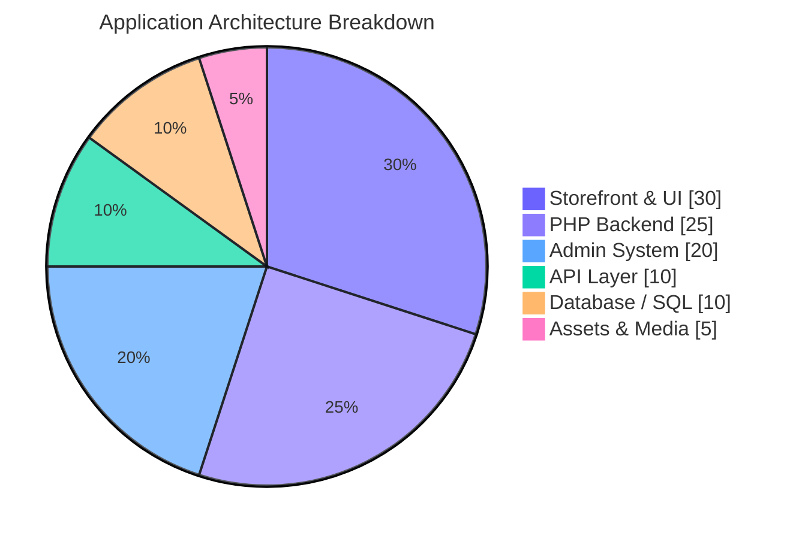

### 📈 Major Functional Areas

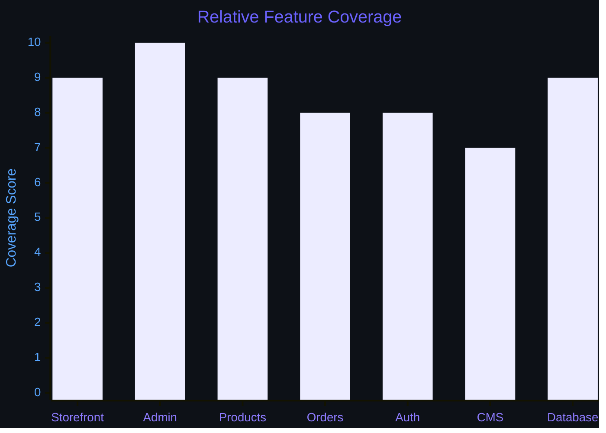

> 🎨 Charts are architectural visualizations — not measured performance benchmarks.

---

## 🧠 Technical Skills Overview

### 🌟 Core Competency Matrix

| 🎯 Skill Area | 📊 Proficiency | 🛠️ Technologies |
|:---|:---|:---|
| 🎨 Frontend Development | `███████████████████░` 95% | HTML · CSS · JavaScript |
| 🐘 Backend Development | `████████████████████` 100% | PHP · Sessions · APIs |
| 🗄️ Database Engineering | `███████████████████░` 95% | MySQL · SQL · Schema Design |
| ⚙️ Admin Development | `████████████████████` 100% | CRUD · CMS · Orders · Users |
| 🔐 Authentication | `██████████████████░░` 90% | Login · Registration · Sessions |
| 🎭 UI / UX Engineering | `██████████████████░░` 90% | Responsive Pages · Navigation |
| 🔀 Version Control | `█████████████████░░░` 85% | Git · GitHub |

### 🎯 Skill Bars (Animated View)

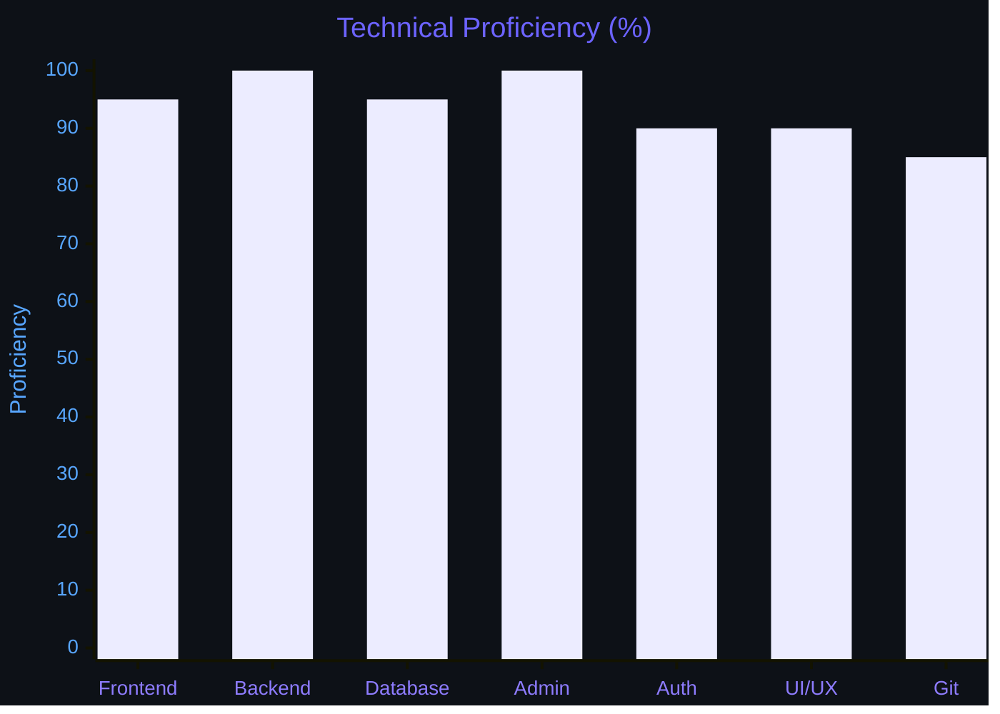

---

## 🏗️ System Architecture

### 🔷 High-Level Architecture

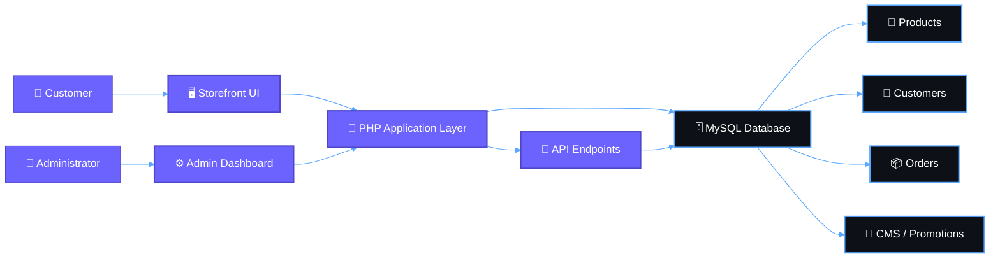

### 🧱 Layered Architecture

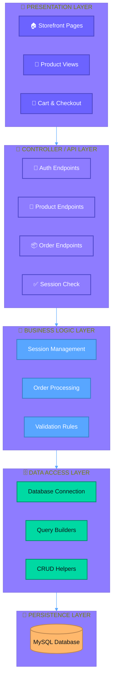

---

## 🔄 Application Flow

### 🎬 Sequence Diagram

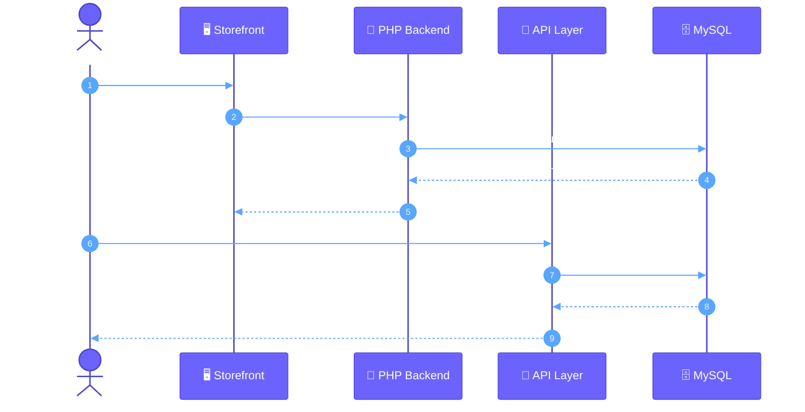

### 🔁 System Interaction Flow

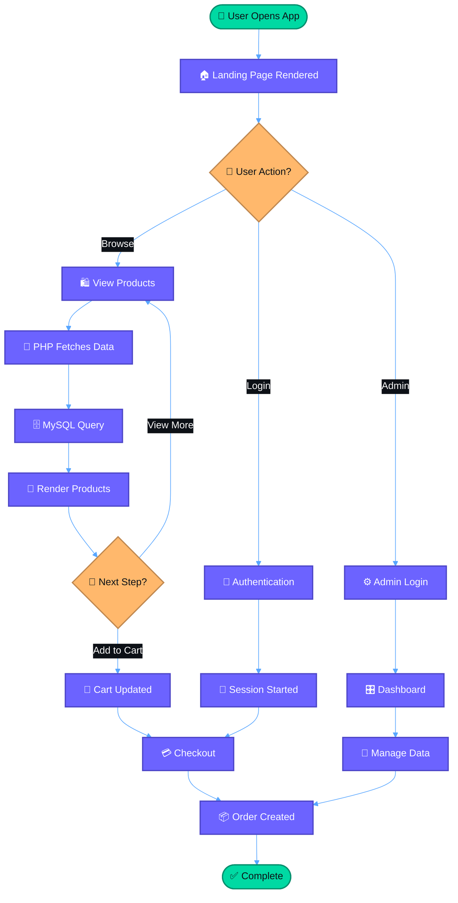

---

## 🛒 Complete Order Workflow

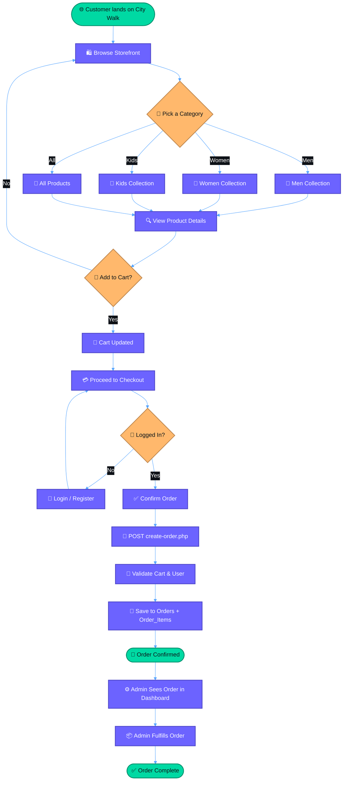

---

## 🔌 API Endpoints

| 🌐 Endpoint | 📮 Method | 🎯 Purpose | 🔐 Auth |
|:---|:---:|:---|:---:|
| `/api/register.php` | `POST` | Register a new customer | ❌ Public |
| `/api/login.php` | `POST` | Authenticate customer, start session | ❌ Public |
| `/api/logout.php` | `POST` | Destroy session and log out | ✅ Session |
| `/api/check-session.php` | `GET` | Verify active session state | ✅ Session |
| `/api/products.php` | `GET` | Fetch product catalogue | ❌ Public |
| `/api/create-order.php` | `POST` | Create order from cart payload | ✅ Session |

---

## 🧩 Feature Matrix

| 🎯 Module | 💡 Capability | 📌 Status |
|:---:|:---|:---:|
| 🏠 Storefront | Home and promotional experience | ✅ |
| 👞 Products | All-products catalogue | ✅ |
| 👨 Men | Dedicated men's collection | ✅ |
| 👩 Women | Dedicated women's collection | ✅ |
| 🧒 Kids | Dedicated kids' collection | ✅ |
| 🔐 Authentication | Login, registration and sessions | ✅ |
| 📦 Orders | Order creation and administration | ✅ |
| 🧑‍💼 Admin | Administrative dashboard | ✅ |
| 🏷️ Categories | Category administration | ✅ |
| 🎯 Promotions | Promotion management | ✅ |
| 🖼️ Banners | Banner management | ✅ |
| 👥 Customers | Customer administration | ✅ |
| ❓ FAQs | FAQ administration | ✅ |
| 📄 CMS | CMS page administration | ✅ |
| 🗃️ Database | SQL schemas and migrations | ✅ |

---

## 📁 Repository Structure

```bash
City-Walk-Full-Stack-Web-Application/
│
├── .gitignore
├── citywalk_db.sql
│
└── city-walk--FINAL/
    ├── admin/
    │   ├── includes/
    │   ├── add-product.php
    │   ├── admins.php
    │   ├── banners.php
    │   ├── categories.php
    │   ├── customers.php
    │   ├── orders.php
    │   ├── products.php
    │   ├── promotions.php
    │   └── ...
    │
    ├── api/
    │   ├── check-session.php
    │   ├── create-order.php
    │   ├── login.php
    │   ├── logout.php
    │   ├── products.php
    │   └── register.php
    │
    ├── assets/
    │   ├── Category-images/
    │   ├── Products/
    │   ├── hero-images/
    │   └── icons/
    │
    ├── css/
    ├── js/
    ├── uploads/
    │
    ├── index.php
    ├── about.php
    ├── contact.php
    ├── all-products.php
    ├── men.php
    ├── women.php
    ├── kids.php
    ├── auth.php
    ├── config.php
    ├── database.php
    ├── database_schema.sql
    └── product_migration.sql
```

---

## ⚙️ Local Installation & Setup

### 1️⃣ — Clone the Repository

```bash
git clone https://github.com/Ahamed369/City-Walk-Full-Stack-Web-Application.git
cd City-Walk-Full-Stack-Web-Application
```

### 2️⃣ — Prepare a Local PHP Environment

Use a local PHP/MySQL environment such as **XAMPP**, **WAMP**, **MAMP**, or an equivalent stack.

### 3️⃣ — Create the Database

```bash
mysql -u root -p your_database_name < citywalk_db.sql
```

Additional schema files:

```
city-walk--FINAL/database_schema.sql
city-walk--FINAL/product_migration.sql
```

### 4️⃣ — Configure Database Connectivity

Review the local database configuration used by:

```
city-walk--FINAL/config.php
city-walk--FINAL/database.php
```

> 🔒 Use local/development credentials and never commit production passwords or secrets.

### 5️⃣ — Run the Application

Start **Apache** and **MySQL**, then open the project through your configured `localhost` URL.

---

## 🔐 Security & Repository Hygiene

| 🛡️ Practice | 📝 Description |
|:---:|:---|
| 🔑 Credential Safety | Keep credentials and secrets outside public source control |
| 🚫 No `.env` in VCS | Never commit `.env` files containing secrets |
| 🔒 Password Hashing | Use password hashing for stored credentials |
| ✅ Input Validation | Validate and sanitize server-side input |
| 🧱 Parameterized Queries | Use parameterized queries to prevent SQL injection |
| 🛂 Authorization Checks | Apply authorization checks to admin routes |
| 🚨 Error Handling | Restrict production error output |
| 📤 Upload Validation | Validate uploaded content by type, size, and destination |
| ♻️ Credential Rotation | Rotate any credential ever committed publicly |

### 🧱 Security Layers (7-Tier Defense)

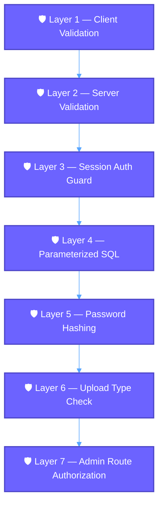

---

## 🗄️ Data & Domain Model

### 🔷 Entity Relationship Diagram

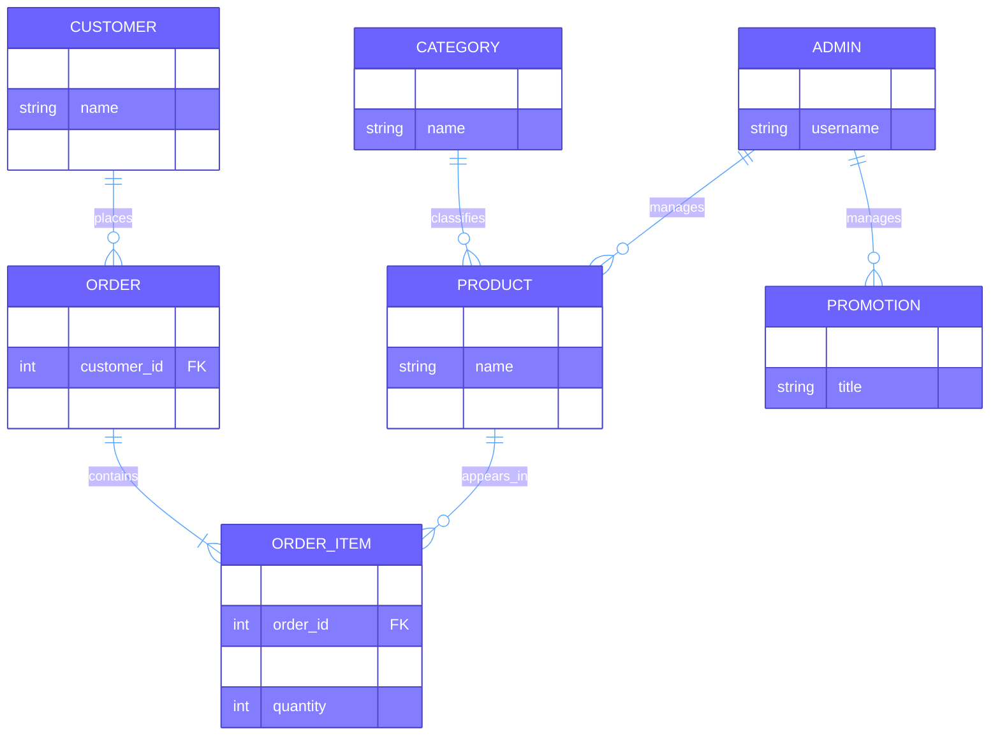

### 🗃️ Table Reference Overview

| 🗄️ Table | 🔑 Primary Key | 🔗 Foreign Keys | 📝 Purpose |
|:---|:---|:---|:---|
| `customers` | `customer_id` | — | Registered buyers |
| `orders` | `order_id` | `customer_id` | One row per placed order |
| `order_items` | `order_item_id` | `order_id`, `product_id` | Line items per order |
| `products` | `product_id` | `category_id` | Catalogue items |
| `categories` | `category_id` | — | Men / Women / Kids grouping |
| `admins` | `admin_id` | — | Back-office users |
| `promotions` | `promotion_id` | `admin_id` | Discount campaigns |

---

## 🎨 Frontend Experience

### 🗺️ Storefront Navigation Map

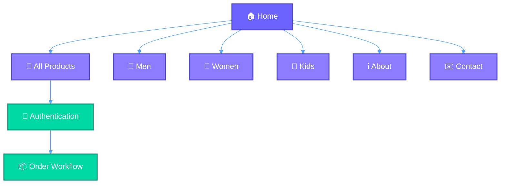

### 🖼️ Page-by-Page Breakdown

| 📄 Page | 🎯 Purpose | 🔧 Tech |
|:---|:---|:---|
| `index.php` | Hero, featured products, promos | PHP + HTML + CSS |
| `men.php` | Men's collection grid | PHP + category filter |
| `women.php` | Women's collection grid | PHP + category filter |
| `kids.php` | Kids' collection grid | PHP + category filter |
| `all-products.php` | Full catalogue with filters | PHP + JS filtering |
| `about.php` | Brand story & info | Static HTML |
| `contact.php` | Contact form | PHP form handler |
| `auth.php` | Login + registration | PHP sessions + JS validation |

### 🎭 UI Interaction Flow

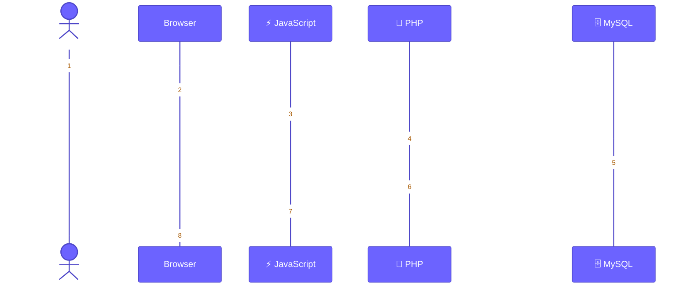

---

## 🛠️ Admin Control Center

### 🧠 Admin Dashboard Mindmap

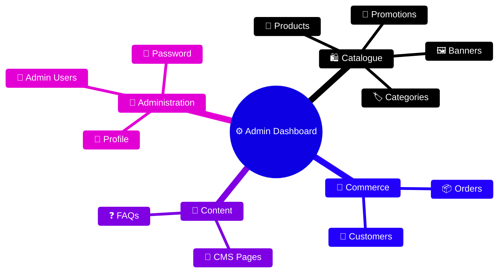

### 🔄 Admin Action Flow

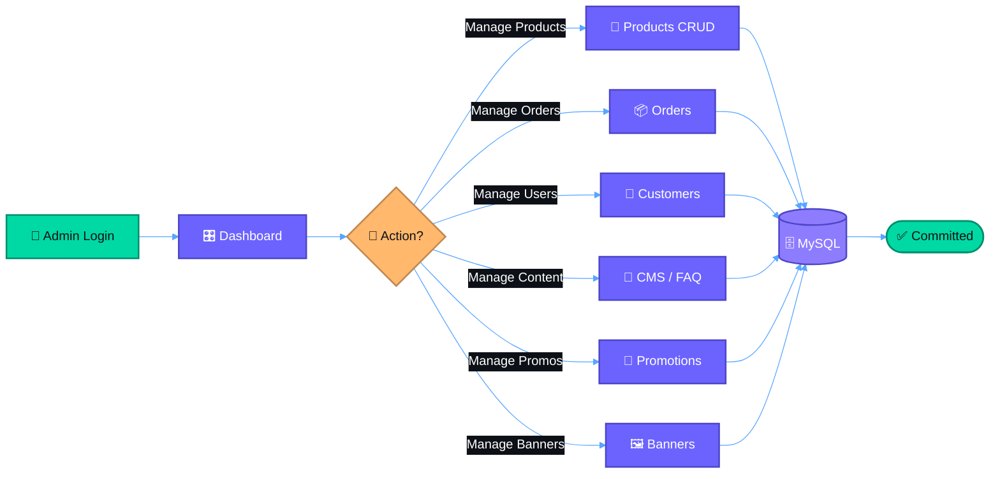

### ⚙️ Admin Module Responsibilities

| 🧩 Module | 🎯 Responsibility | 📁 File |
|:---|:---|:---|
| Dashboard | Overview stats, quick actions | `admin/index.php` |
| Products | Full CRUD + image upload | `admin/products.php` |
| Add Product | Multi-field product entry form | `admin/add-product.php` |
| Categories | Group products by Men/Women/Kids | `admin/categories.php` |
| Customers | View, search, manage accounts | `admin/customers.php` |
| Orders | Review + update order status | `admin/orders.php` |
| Promotions | Create discount campaigns | `admin/promotions.php` |
| Banners | Manage homepage banners | `admin/banners.php` |
| Admins | Add/edit other admin accounts | `admin/admins.php` |
| Profile & Password | Self-service credential management | `admin/profile.php` |

---

## 🚀 Development Workflow

### 🌳 Git Branching History

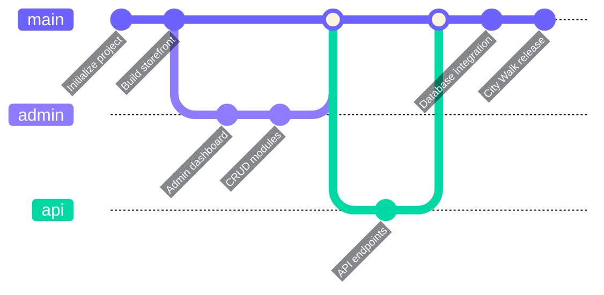

### 🧑‍💻 Contribution Workflow

```mermaid
%%{init: {'theme':'base', 'themeVariables': {
  'primaryColor':'#6C63FF','primaryTextColor':'#fff','primaryBorderColor':'#4d46c8',
  'lineColor':'#58A6FF','secondaryColor':'#0D1117','tertiaryColor':'#8E7CFF'
}}}%%
flowchart LR
    A["📥 Issue / Feature Idea"] --> B["🌿 Create Branch"]
    B --> C["💻 Write Code"]
    C --> D["🧪 Test Locally"]
    D --> E["💾 Commit"]
    E --> F["📬 Open PR"]
    F --> G["👀 Review"]
    G --> H["✅ Merge"]

    classDef step fill:#6C63FF,color:#fff,stroke:#4d46c8,stroke-width:2px;
    class A,B,C,D,E,F,G,H step;
```

---

## 📈 Engineering Focus

| 🎯 Engineering Area | 📊 Focus Meter |
|:---|:---|
| Full-Stack Integration | `██████████` 100% |
| Database Connectivity | `██████████` 100% |
| Administrative CRUD | `██████████` 100% |
| Product Management | `██████████` 100% |
| Authentication & Sessions | `█████████░` 90% |
| Responsive UI | `█████████░` 90% |
| Content Management | `████████░░` 80% |

### 🎯 Engineering Focus — Visual Chart

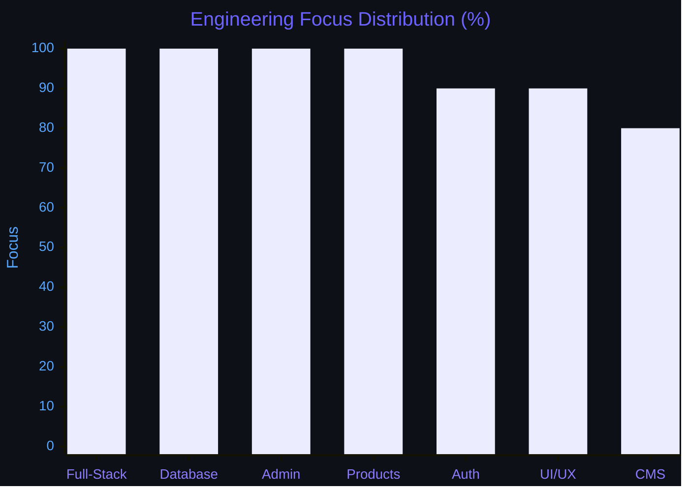

---

## 🧪 Testing Checklist

### 🔐 Auth & Sessions
- [ ] Customer registration
- [ ] Customer login/logout
- [ ] Session persistence
- [ ] Admin authentication
- [ ] Input validation
- [ ] Password hashing

### 🛍️ Commerce Flow
- [ ] Product retrieval
- [ ] Men/Women/Kids filtering
- [ ] Order creation
- [ ] Order management
- [ ] Customer management
- [ ] Cart integrity

### ⚙️ Admin & Content
- [ ] Product CRUD operations
- [ ] Category management
- [ ] Banner and promotion management
- [ ] FAQ/CMS management
- [ ] Responsive behavior
- [ ] Upload validation

---

## 🌟 Future Enhancements

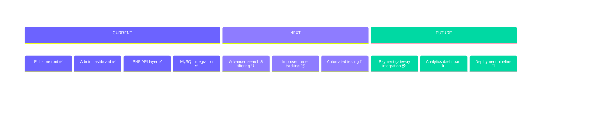

| 🏁 Version | 🎯 Milestone | 📋 Planned Features |
|:---:|:---|:---|
| v1.0.0 | Foundation Release | Storefront, Admin, API, DB ✅ |
| v1.1.0 | Enhanced Discovery | Search, filters, sorting, wishlist |
| v1.2.0 | Order Experience | Tracking, invoices, email notifications |
| v1.3.0 | Quality & Tests | Automated test suite, CI pipeline |
| v2.0.0 | Commerce Growth | Payments, analytics, multi-language |
| v2.1.0 | Scale & Deploy | Docker, CDN, deployment pipeline |

---

## 👨‍💻 Developer

<div align="center">

<a href="https://github.com/Ahamed369">
  
</a>

<br/><br/>


</div>

---

## 🤝 Contributions

1. 🍴 **Fork** the repository
2. 🌿 **Create** a descriptive feature branch (`feature/add-search`)
3. 💾 **Commit** with clear messages (`feat: add product search endpoint`)
4. ⬆️ **Push** your branch
5. 📬 **Open** a pull request with a description of the change

---

## 📌 Repository

<div align="center">

<a href="https://github.com/Ahamed369/City-Walk-Full-Stack-Web-Application">
  
</a>

<br/><br/>

**⭐ If this project is useful to you, consider giving the repository a star!**

<br/>


</div>

---

<div align="center">


<br/><br/>


<br/>

**© 2024 M.R. Ahamed · City Walk Full-Stack Web Application**

<br/>


</div>
